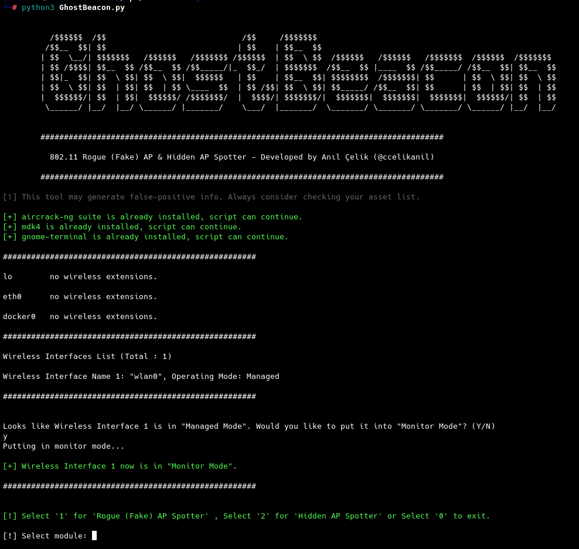
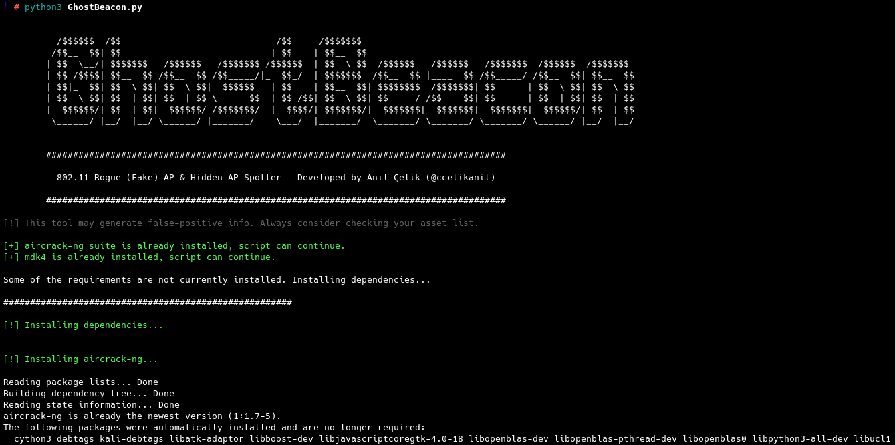
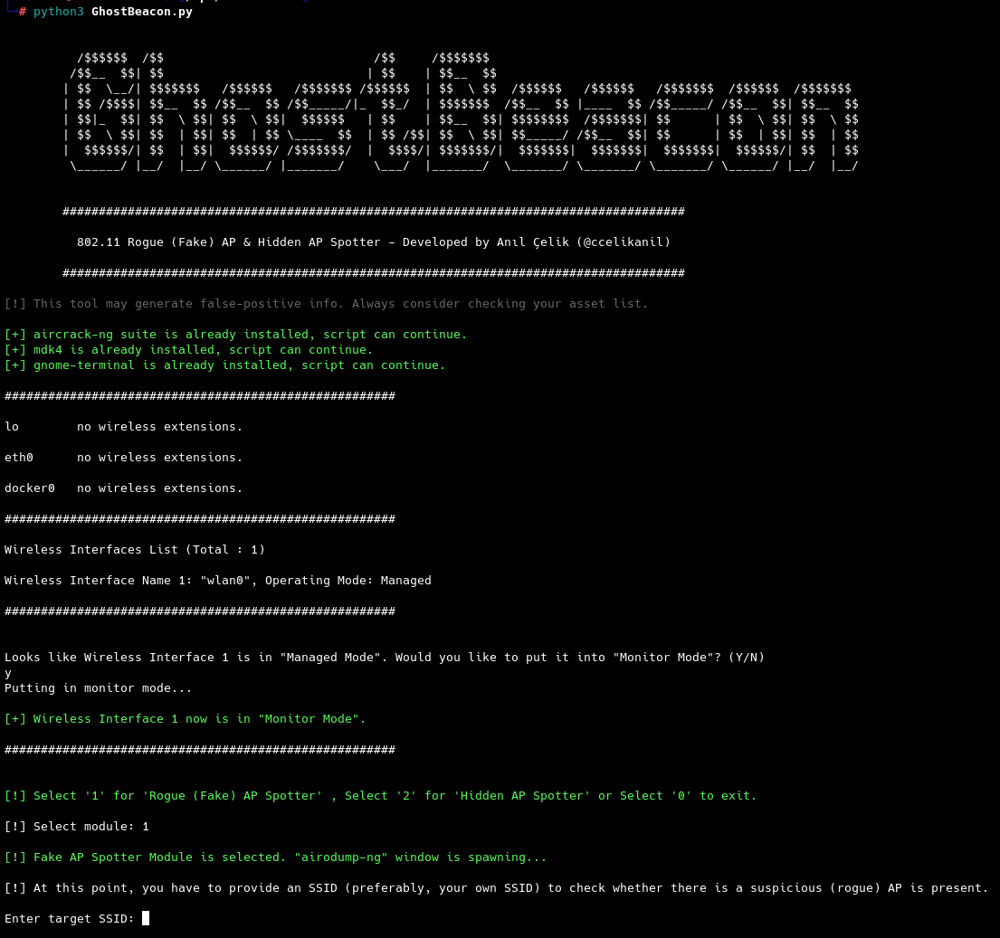
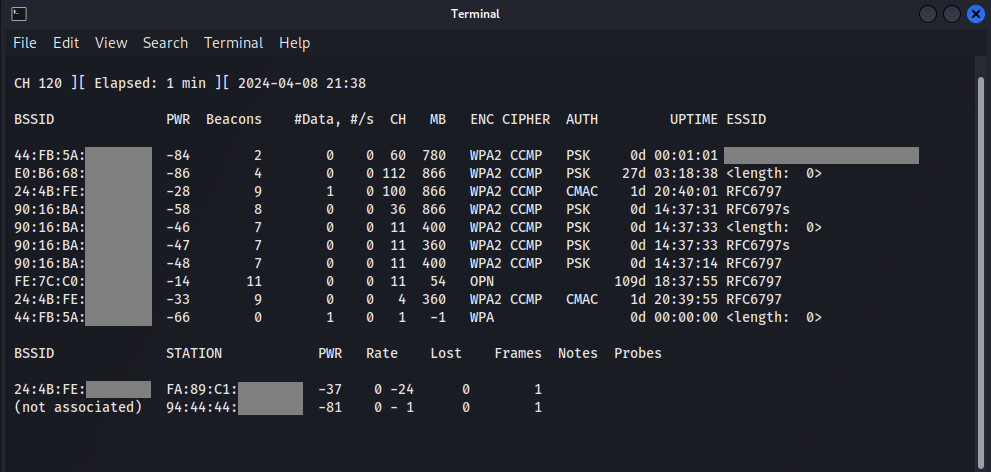
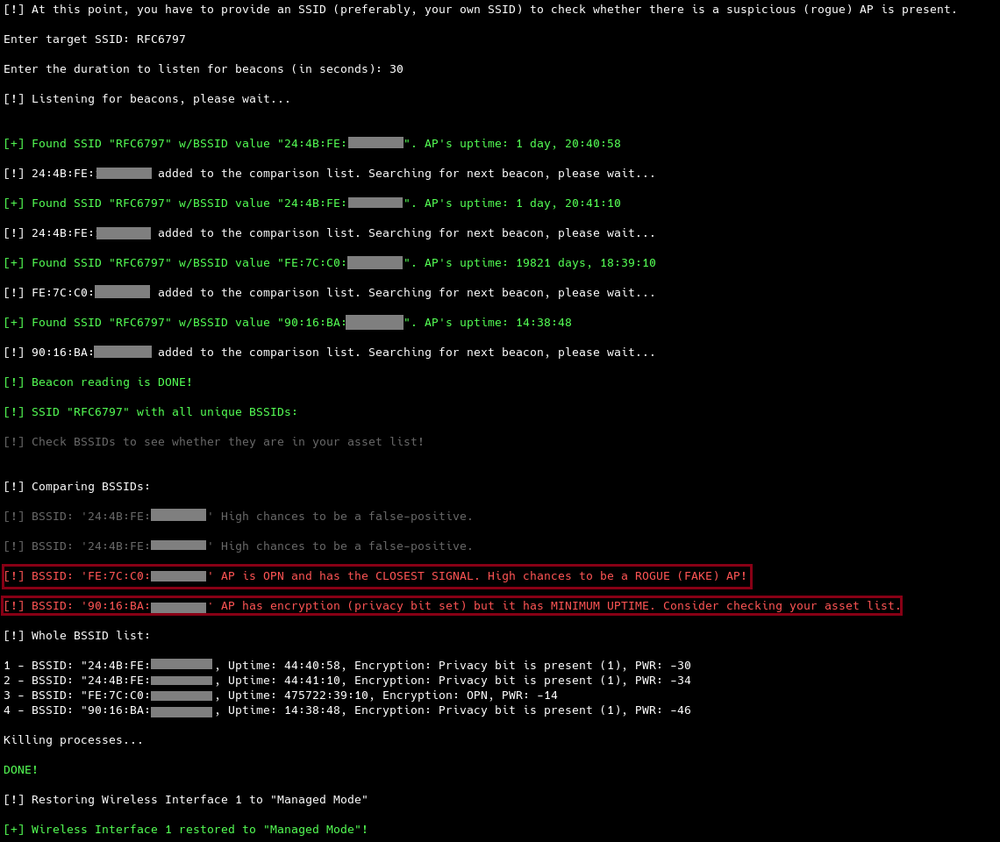
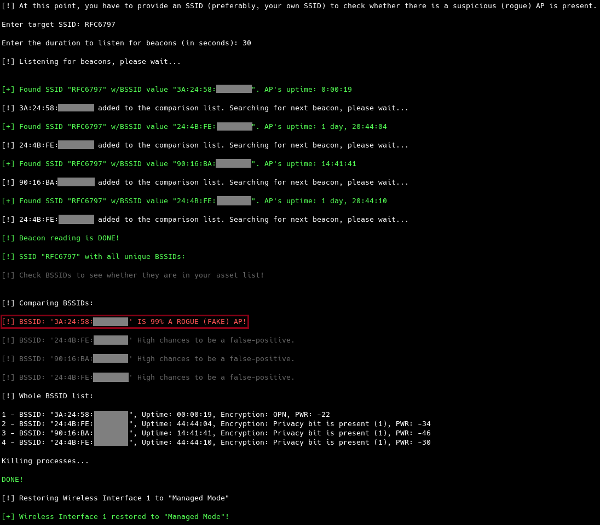
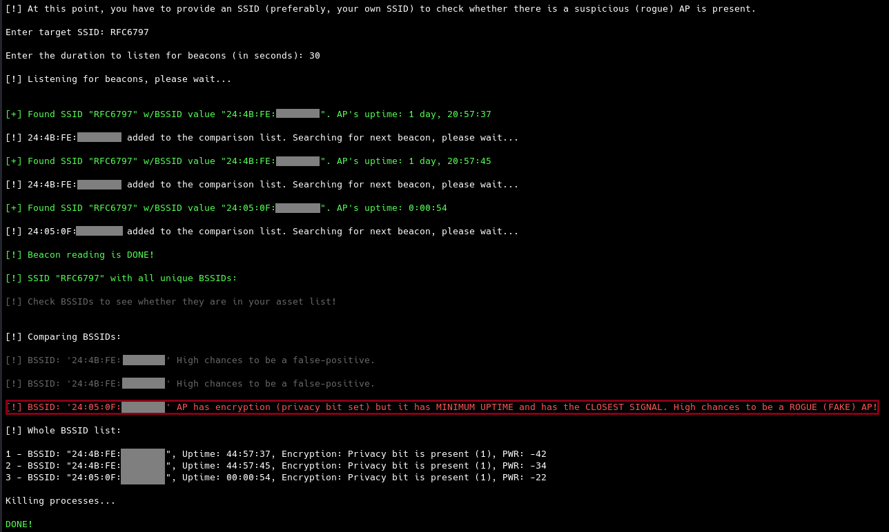
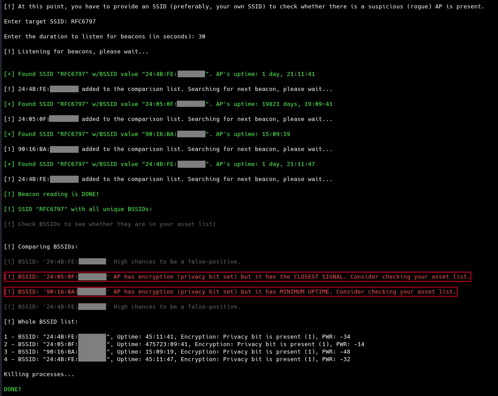
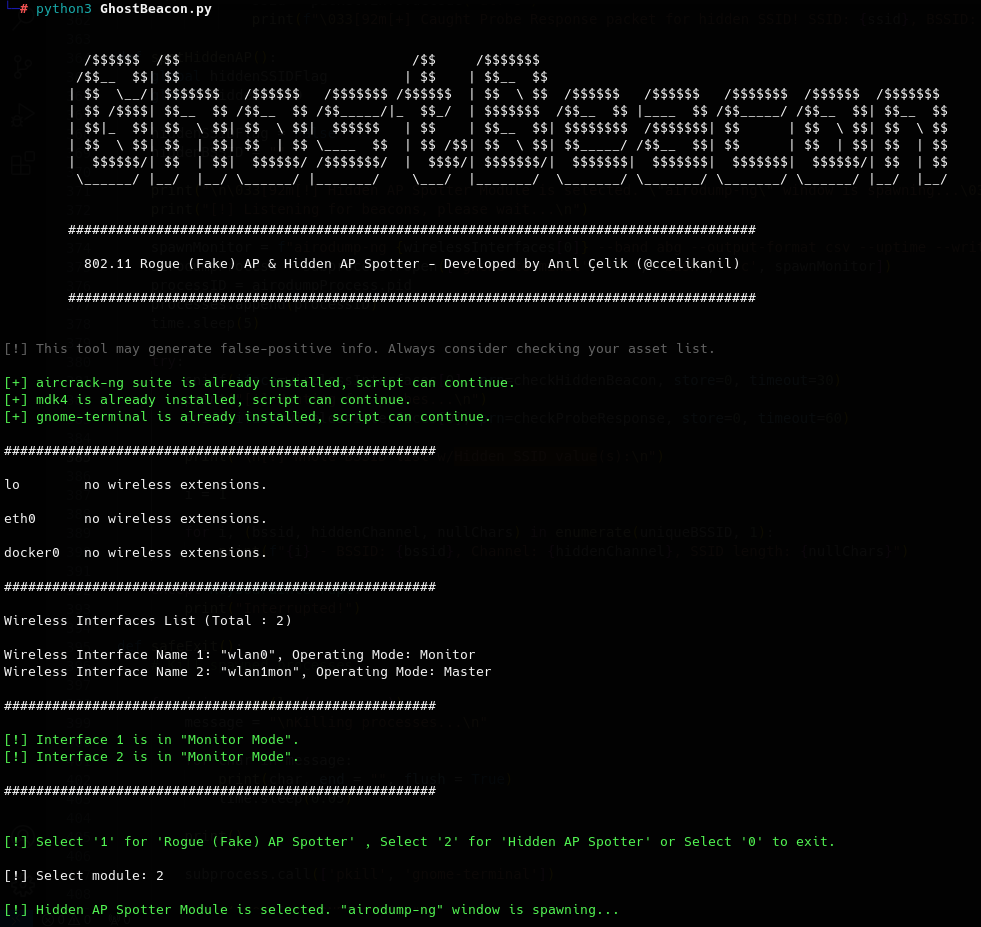

# GhostBeacon

<p align="center">  </p>                                                                                                                

# CLI-based 802.11 Hidden Access Point (AP) & Rogue (Fake) Access Point (AP) Spotter

## Features:

1. 802.11 Rogue (Fake) Access Point Spotter
2. 802.11 Hidden Access Point Spotter

## How it works?

You can visit my **Medium post** for a long explanation.

TL;DR - Basically, provided features are depending on how 802.11 protocol works. 

## Some PoCs

### Main Menu

<p align="center">  </p>
<p align="center"> Figure #1 - Main Menu </p>

- Program first checks if the dependencies are installed on target OS. If dependencies are not installed, program calls ``rsc/setup.sh`` setup file to install dependencies automatically:

<p align="center">  </p>
<p align="center"> Figure #2 - Dependency Installation</p>

- Then, program checks whether there's a wireless card plugged in and then it checks if corresponding wireless card is in **"Monitor Mode"**. Since we are going to sniff the air for capturing packets, the card needs to be in **"Monitor Mode"**. 
- After necessary checks completed, users can choose ``1`` for  **"Rogue (Fake) AP Spotter"** module or ``2`` for **Hidden AP Spotter"** module.

### Module #1: Rogue (Fake) Access Point Spotter

<p align="center">  </p>
<p align="center"> Figure #3 - Rogue (Fake) AP Spotter Module </p>

- In this module, an ``airodump-ng`` window pops up to display available SSIDs in wireless card's scan range.

<p align="center">  </p>
<p align="center"> Figure #4 - airodump-ng </p>

- Then, users are asked to enter an SSID value to check if there's any rogue (fake) access point with same SSID is present.
- Also, users are asked to enter a value for packet sniffing duration.
- When these inputs are provided, the program starts to sniff **"Beacon Frames"** in the area and saves all access points with unique BSSID (MAC address) values into a list *- namely, the "Comparison List*".

<p align="center">  </p>
<p align="center"> Figure #5 - Sample Run: Spotting Rogue (Fake) Access Points </p>

**Explanation of **"Figure #5"** is as follows:**
- User first inputs an SSID value, **"RFC6797"**, followed by the duration value, **"30"**.
- Program finds **4** unique access points with given SSID and saves them into the comparison list.
- After completing Beacon listening, program does it's calculation depending on following code:

  ```
  Pseudo-code of lines 271..294 in GhostBeacon.py
  
    iterate (for) through uniqueBSSID list:
        if bssid.encryption is None:
            if bssid.uptime is minUptime:
                if bssid.pwr is minPWR:
                    print("AP IS 99% A ROGUE (FAKE) AP!")
                else if bssid.pwr not minPWR:
                    print("AP is OPN and has MINIMUM UPTIME. High chances to be a ROGUE (FAKE) AP!")
            else if bssid.uptime not minUptime:
                if bssid.pwr is minPWR:
                    print("AP is OPN and has the CLOSEST SIGNAL. High chances to be a ROGUE (FAKE) AP!")
                else if bssid.pwr not minPWR:
                    print("AP is OPN. Might be a ROGUE (FAKE) AP. Consider checking your asset list.

      else if bssid.encryption not None:
          if bssid.uptime is minUptime:
                if bssid.pwr is minPWR:
                    print("AP has encryption (privacy bit set) but it has MINIMUM UPTIME and has the CLOSEST SIGNAL. High chances to be a ROGUE (FAKE) AP!")
                else if bssid.pwr not minPWR:
                    print("AP has encryption (privacy bit set) but it has MINIMUM UPTIME. Consider checking your asset list.")
          else if bssid.uptime not minUptime:
                if bssid.pwr is minPWR:
                    print("AP has encryption (privacy bit set) but it has the CLOSEST SIGNAL. Consider checking your asset list.")
                else if bssid.pwr not minPWR:
                    print("High chances to be a false-positive.")
  ```
<p align="center"> Code Snippet #1 - Pseudo-code of Rogue (Fake) AP Detection Mechanism </p>

**Brief explanation:**
- Rogue *(Fake)* Access Points generally have no encryption *(they are OPN)* to force victims for connecting them to their fake APs and ask the original AP's password by using a **Captive Portal**. That's why our first check is AP's encryption *(i.e. Privacy Bit)*.
- Since Fake APs are deployed later than the original AP, their uptime values are usually shorter than the original AP. Even though uptime value is easy to fake, it's still pretty easy to discriminate this value.
- Due to 802.11's protocol implementation, clients are tend to connect to the nearest AP among the ones having same SSID value. Which brings us to our next control: **PWR (TX)** check *(i.e. Signal Strength)*. If an attacker wants a victim to connect to their Rogue AP, they first need to disconnect the victim from original AP and force them to send a connection request *(i.e. Probe Request)* to their Rogue AP by setting up an AP with stronger signal.
- Fake APs may have encryption *(they may have their Privacy Bit set)*. If target BSSID has an encryption, same controls needs to be done as we did on OPN BSSIDs.     
<p align="center">  </p>
<p align="center"> Figure #6 - Sample Run: Spotting Rogue (Fake) Access Points </p>

<p align="center">  </p>
<p align="center"> Figure #7 - Sample Run: Spotting Rogue (Fake) Access Points </p>

<p align="center">  </p>
<p align="center"> Figure #8 - Sample Run: Spotting Rogue (Fake) Access Points </p>

### Module #2: Hidden Access Point Spotter 

<p align="center">  </p>
<p align="center"> Figure #9 - Hidden AP Spotter Module </p>


## What's next?

...
