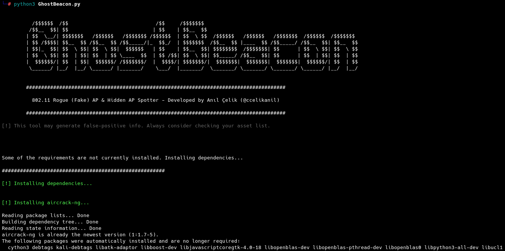
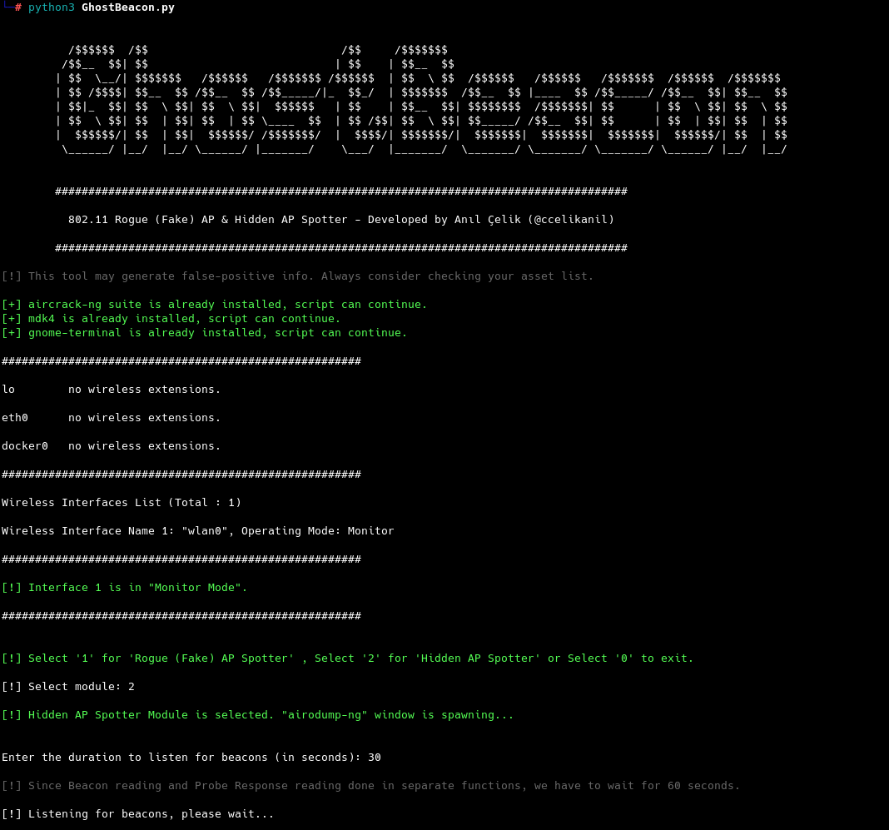

# GhostBeacon v1.0

<p align="center">  </p>                                                                                                                

# CLI-based 802.11 Hidden Access Point (AP) & Rogue (Fake) Access Point (AP) Spotter

## Features:

1. 802.11 Rogue (Fake) Access Point Spotter
2. 802.11 Hidden Access Point Spotter

## Proof-of-Concepts (PoCs) & How it works

TL;DR - Basically, provided features are depending on how 802.11 protocol works. 

### Main Menu

<p align="center">  </p>
<p align="center"> Figure #1 - Main Menu </p>

- Program first checks if the dependencies are installed on target OS. If dependencies are not installed, program calls ``rsc/setup.sh`` setup file to install dependencies automatically:

<p align="center">  </p>
<p align="center"> Figure #2 - Dependency Installation</p>

- Then, program checks whether there's a wireless card plugged in and then it checks if corresponding wireless card is in **"Monitor Mode"**. Since we are going to sniff the air for capturing packets, the card needs to be in **"Monitor Mode"**. 
- After necessary checks completed, users can choose ``1`` for  **"Rogue (Fake) AP Spotter"** module or ``2`` for **Hidden AP Spotter"** module.

### Module #1: Rogue (Fake) Access Point Spotter

<p align="center">  </p>
<p align="center"> Figure #3 - Rogue (Fake) AP Spotter Module </p>

- In this module, an ``airodump-ng`` window pops up to display available SSIDs in wireless card's scan range.

<p align="center">  </p>
<p align="center"> Figure #4 - airodump-ng </p>

- Then, users are asked to enter an SSID value to check if there's any rogue (fake) access point with same SSID is present.
- Also, users are asked to enter a value for packet sniffing duration.
- When these inputs are provided, the program starts to sniff **"Beacon Frames"** in the area and saves all access points with unique BSSID (MAC address) values into a list *- namely, the "Comparison List*".

<p align="center">  </p>
<p align="center"> Figure #5 - Sample Run: Spotting Rogue (Fake) Access Points </p>

**Explanation of **"Figure #5"** is as follows:**
- User first inputs an SSID value, **"RFC6797"**, followed by the duration value, **"30"**.
- Program finds **4** unique access points (in this particular example) with given SSID and saves them into the comparison list.
- After completing Beacon sniffing, program does it's calculation depending on following code:

  ```
  Pseudo-code of lines 271..294 in GhostBeacon.py
  
    iterate (for) through uniqueBSSID list:
        if bssid.encryption is None:
            if bssid.uptime is minUptime:
                if bssid.pwr is minPWR:
                    print("AP IS 99% A ROGUE (FAKE) AP!")
                else if bssid.pwr not minPWR:
                    print("AP is OPN and has MINIMUM UPTIME. High chances to be a ROGUE (FAKE) AP!")
            else if bssid.uptime not minUptime:
                if bssid.pwr is minPWR:
                    print("AP is OPN and has the CLOSEST SIGNAL. High chances to be a ROGUE (FAKE) AP!")
                else if bssid.pwr not minPWR:
                    print("AP is OPN. Might be a ROGUE (FAKE) AP. Consider checking your asset list.

      else if bssid.encryption not None:
          if bssid.uptime is minUptime:
                if bssid.pwr is minPWR:
                    print("AP has encryption (privacy bit set) but it has MINIMUM UPTIME and has the CLOSEST SIGNAL. High chances to be a ROGUE (FAKE) AP!")
                else if bssid.pwr not minPWR:
                    print("AP has encryption (privacy bit set) but it has MINIMUM UPTIME. Consider checking your asset list.")
          else if bssid.uptime not minUptime:
                if bssid.pwr is minPWR:
                    print("AP has encryption (privacy bit set) but it has the CLOSEST SIGNAL. Consider checking your asset list.")
                else if bssid.pwr not minPWR:
                    print("High chances to be a false-positive.")
  ```
<p align="center"> Code Snippet #1 - Pseudo-code of Rogue (Fake) AP Detection Mechanism </p>

**Brief explanation:**
- Rogue *(Fake)* Access Points generally have no encryption *(they are OPN)* to force victims for connecting them to their fake APs and ask the original AP's password by using a **Captive Portal**. That's why our first check is AP's encryption *(i.e. Privacy Bit)*.
- Since Fake APs are deployed later than the original AP, their uptime values are usually shorter than the original AP. Even though uptime value is easy to fake, it's still pretty easy to discriminate this value.
- Due to 802.11's protocol implementation, clients are tend to connect to the nearest AP among the ones having same SSID value. Which brings us to our next control: **PWR (TX)** check *(i.e. Signal Strength)*. If an attacker wants a victim to connect to their Rogue AP, they first need to disconnect the victim from original AP and force them to send a connection request *(i.e. Probe Request)* to their Rogue AP by setting up an AP with stronger signal.
- Fake APs may have encryption *(they may have their Privacy Bit set)*. If target BSSID has an encryption, same controls needs to be done as we did on OPN BSSIDs.     
<p align="center">  </p>
<p align="center"> Figure #6 - Sample Run: Spotting Rogue (Fake) Access Points </p>

<p align="center">  </p>
<p align="center"> Figure #7 - Sample Run: Spotting Rogue (Fake) Access Points </p>

<p align="center">  </p>
<p align="center"> Figure #8 - Sample Run: Spotting Rogue (Fake) Access Points </p>

### Module #2: Hidden Access Point Spotter 

<p align="center">  </p>
<p align="center"> Figure #9 - Hidden AP Spotter Module </p>

<p align="center">  </p>
<p align="center"> Figure #10 - Sample Run: Hunting Hidden AP's SSID Value </p>

**Explanation of "Figure #10" is as follows:**
- User inputs a timeout value for Beacon sniffing.
- See below:

```
Lines 388..391 in GhostBeacon.py
...

try:
		sniff(iface=wirelessInterfaces[0], prn=checkHiddenBeacon, store=0, timeout=timeout)
		print("[!] Hunting for probes...\n")
		sniff(iface=wirelessInterfaces[0], prn=checkProbeResponse, store=0, timeout=timeout)

...
```
<p align="center"> Code Snippet #2 - Function Calls for "checkHiddenBeacon" and "checkProbeResponse" </p>

- In above snippet, since **"Probe Response"** sniffing is done after Beacon sniffing, the same timeout value needs to be applied in here and that's why we have to wait for ``timeout*2`` seconds.
- Program first discovers **"Beacon Frames"** and checks whether the SSID value is hidden in that specific Beacon Frame packet.
- Determining whether the SSID is hidden or not is pretty simple and can be done in two ways: **First way is:** if **"Clear Beacons"** are being sent, that is, if the SSID length is zero, this means that the SSID is hidden. **Second way is:** If SSID has **"Null Bytes (``\000``)"** inside it's value, this means that that SSID is also hidden. Luckily, we can guess the SSID length by counting null bytes inside the SSID info.

How hidden SSID values being captured and what is the relationship with **"Probe Response"** packets? Well, there are couple of different ways for finding out the real values for hidden SSIDs. What we are currently doing in this program's first version is as follows:
- When you set an AP to hide it's SSID info, you are basically telling that AP to hide it's SSID information on the **"Beacon Frames"** that it broadcasts. **"Beacon Frames"** are the packets that APs broadcasts to let every STATION (STA) *- i.e. clients* nearby that they exist and available for connection requests. When this information *- namely, the SSID* is hidden, naturally, nobody would be able to send any connection request to this AP, except the ones having the correct information.
- However, it's not so hard to identify this *hidden* information.

Let's go deeper:

We will be focusing on **3 *(three)*** frames in below figure: **"Beacon Frames"**, **"Probe Requests"** & **"Probe Responses"**

<p align="center">  </p>
<p align="center"> Figure #11 - Communication Between Access Point (AP) and Client (Station/STA) </p>

- Like previously said, AP's need to send **"Beacon Frames"** to tell nearby clients that they are ready for connection.

<p align="center">  </p>
<p align="center"> Figure #12 - 802.11 Beacon Frame </p>

- Note that, a **"Beacon Frame"**'s key elements are **"Source Address"** and **"Transmitter Address"** has AP's MAC address *- namely, AP's BSSID*
- **"Receiver Address"** and **"Transmitter Address"** values are ``FF:FF:FF:FF:FF:FF``, which means the packet is being sent as **Broadcast**.
- **"SSID"** and **"Channel Number"** sections are also set to tell clients that what this AP's name and which channel that it is currently present. **"Channel Number"** is also another important point because Access Point and the Client should be on the same channel number for a successful connection.
- Other information about this frame class is irrelevant for now.

- When a **"STATION/STA"** *- or Client* wants to connect to a specific Access Point, it simply needs to send a **"Probe Request"** containing corresponding AP's **"SSID"** information and their **"Channel Number"**:

<p align="center">  </p>
<p align="center"> Figure #13 - 802.11 Probe Request </p>

- In a **"Probe Request"** packet, we can see that the **"Destination Address"** and **"Receiver Address"** values are ``FF:FF:FF:FF:FF:FF``, similar to a **"Beacon Frame"**. This means that clients are sending out their connection requests as broadcasts signals also.
- Respectively, **"Transmitter Address"** and **"Source Address"** sections are the values of client's MAC address *- client BSSID*.
- Lastly, the **"SSID"** value and **"Channel Number"** of target AP is specified in this packet to tell APs that somebody wants to connect to a nearby AP with specified SSID information and given channel number *- if possible*.
- **Note:** Clients doesn't have to be on the same channel with the AP before connection. Clients offer a channel number to APs to see whether they are available on that channel and APs offer their own channel number to clients otherwise.    

We understood the first communication between an Access Point and a Client up to now. Where is the important part?

See a **"Probe Response"** frame below *(w/o Hidden SSID information - everything's normal)*:

<p align="center">  </p>
<p align="center"> Figure #14 - 802.11 Probe Repsonse </p>

- In a **"Probe Response"** packet, **"Destination Address"** and **"Receiver Address"** values are the same values we had in **"Probe Request"** packet's **"Transmitter Address"** and **"Source Address"** sections. Which means that a **"Probe Response"** packet is sending out from AP to the client.
- What is important in here is that whether the SSID information is hidden or not, Access Points **HAS TO** send out their correct SSID information once they receive a a **"Probe Request"** related with them. By leveraging this *"feature"*, we can identify the correct SSID information by sniffing **"Probe Response"** packets.    

See a **"Beacon Frame"** w/Hidden SSID information & **"Probe Response"** w/Hidden SSID information below :

<p align="center">  </p>
<p align="center"> Figure #15 - 802.11 Beacon Frame (w/Hidden SSID information) </p>

<p align="center">  </p>
<p align="center"> Figure #16 - 802.11 Probe Response (Hidden SSID revealed) </p

### Other methods to detect Hidden SSID information *(see* [What's next? & Current Roadmap](https://github.com/ccelikanil/GhostBeacon?tab=readme-ov-file#whats-next--current-roadmap-for-this-project) *Section)*

## What's next? & Current Roadmap for this project

### For Rogue (Fake) Access Point Spotter Module, following features will be added:

- Rogue AP spotting decision mechanism will be improved: **"Average Uptime Calculation"** will be included.
- TX median *may* be calculated for better approximation.
- **"Organizational Unique Identifier (OUI)"** support will be included to separate Rogue APs from their vendor information.
- **"Captive Portal"** detection mechanism will be included.
- Certificate inspection mechanism will be included for 802.1x (Enterprise) networks.
- **"Deauthentication Attacks"** will be included to use **Denial of Service (DoS)** attacks against suspicious APs. 

### For Hidden Access Point Spotter Module, following features will be added:

- Module will be divided into two sections: **"Passive Reconnaissance"** & **"Active Reconnaissance"**
- **"Passive Reconnaissance"** will keep **"Probe Response"** analysis, will add additional features for passive listening.
- **"Active Reconnaissance"** will include **"Deauthentication Attacks"** to force connected clients for disconnecting them from target AP & reconnecting to the AP.


*Any other features are open for suggestion, please do not hesitate to recommend your ideas.*


[](https://www.buymeacoffee.com/anilcelik) 
